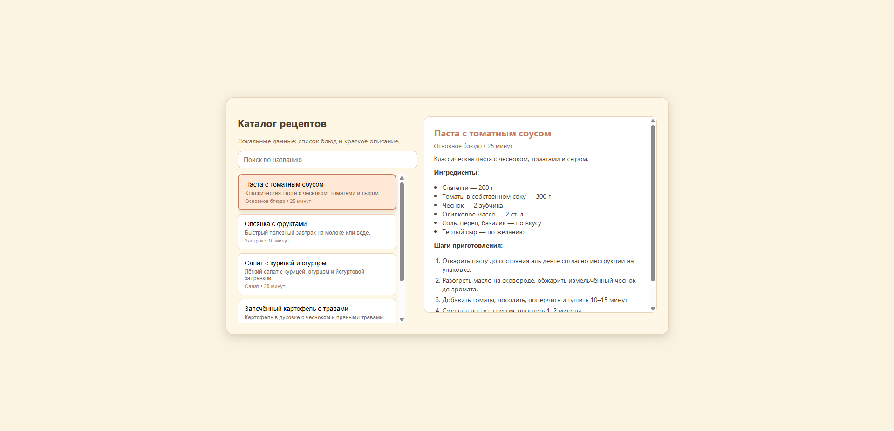

# Каталог рецептов (React)   
**Скворцов Александр ЭФБО-07-24**
Вариант 27  

---

## Описание проекта

Проект представляет собой одностраничное React-приложение, которое отображает каталог кулинарных рецептов.  
Все данные хранятся **локально** внутри приложения — массив рецептов встроен в код (`App.js`).

Приложение позволяет:
- просматривать список блюд,
- выполнять поиск по названию,
- выбирать рецепт и видеть подробное описание,
- просматривать ингредиенты и шаги приготовления,

---

## Скриншоты приложения

### Главный экран

### Поиск рецептов

